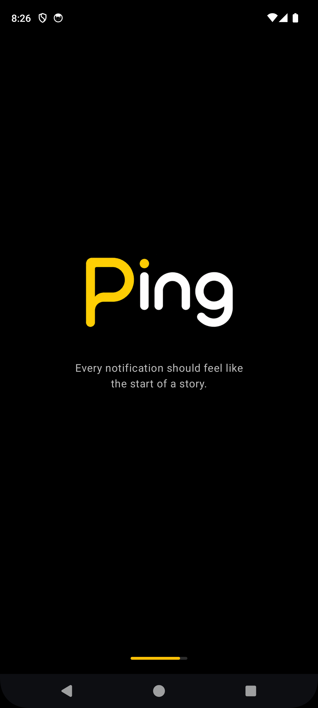
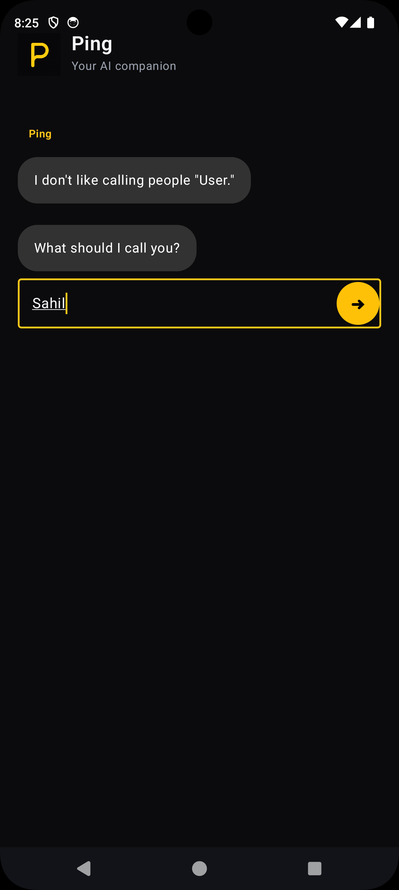

# Ping

> **Every notification should feel like the start of a story.**

Ping is a conversation-first Android application that explores how meaningful conversations, thoughtful prompts, and AI can create healthier digital experiences.

Built with **Kotlin** and **Jetpack Compose**, Ping is developed using production-oriented Android engineering practices with a strong focus on clean architecture, maintainability, and scalability.

---

# ✨ Vision

People don't repeatedly open messaging apps because they love chat bubbles.

They return because they anticipate something meaningful waiting for them.

Ping is built around recreating that feeling in a healthier, calmer, and more intentional way.

---

# 💡 Why Ping?

Messaging apps keep us coming back because every notification carries uncertainty and anticipation.

Ping explores how software can recreate that feeling through meaningful conversations, reflection, and AI—without relying on addictive feeds, endless scrolling, or vanity metrics.

---

# 🚀 Project Status

**Stage:** 🚧 MVP Development

**Current Version:** `v0.2.0`

### ✅ Completed

- Project Initialization
- Android Studio Setup
- Git & GitHub Integration
- Engineering Documentation
- Splash Screen
- Conversation-First Onboarding
- Ping Conversation Identity
- Navigation Architecture
- Navigation Compose Integration
- Message Bubble Component
- Typing Indicator Component
- Conversation Input Component
- Dark Theme
- Launcher Branding
- APK Generation
- Android Emulator Testing
- Physical Device Testing


### 📱 Current Progress

<table>
<tr>
<td align="center"><b>Splash Screen</b></td>
<td align="center"><b>Conversation-First Onboarding</b></td>
</tr>

<tr>
<td>
<a href="screenshots/day5_splash.png">

</a>
</td>

<td>
<a href="screenshots/day5_onboarding.png">

</a>
</td>
</tr>
</table>
 
### 🚧 Current Focus

**Issue #5 — Build the Welcome Experience**


### 🔜 Upcoming

- Welcome Experience
- Home Screen
- Reflection Conversations
- Future Self Conversations
- Search
- Profile
- Settings
- Local Data Storage
- AI Integration

---

# 🏆 Latest Milestone

Ping now delivers its first complete conversation-first onboarding experience.

```text
Launch App
      ↓
Splash Screen
      ↓
Conversation-First Onboarding
      ↓
Personalized Welcome
      ↓
(Home Screen — Next Milestone)
```

The onboarding now establishes Ping's identity through thoughtful conversation rather than traditional setup screens.

The experience has been tested successfully on both the Android Emulator and a physical Android device.
---

# 🛠 Tech Stack

## Current

- Kotlin
- Jetpack Compose
- Material 3
- Navigation Compose
- Android Studio
- Git
- GitHub

## Planned

- MVVM
- StateFlow
- Room Database
- Hilt
- Retrofit
- Firebase
- Gemini API

---

# 📂 Documentation

Project documentation evolves alongside the product and is maintained inside the `docs/` directory.

Current documentation includes:

- Engineering Journal
- Product Roadmap
-  GitHub Issue Documentation

Coming soon:

- Architecture Decision Records (ADR)
- Troubleshooting Guide
- Android Engineering Notes
- Changelog

---

# 🎯 Development Philosophy

Ping is built around one simple engineering principle:

> **Build small. Ship often. Document everything. Improve continuously.**

Every feature follows a structured workflow:

```text
Idea
   ↓
GitHub Issue
   ↓
Implementation
   ↓
Testing
   ↓
Documentation
   ↓
Release
```

---

# 🏗 Engineering Principles

Ping is developed using production-oriented Android engineering practices with emphasis on:

- Issue-driven development
- Conversation-first product design
- Incremental feature delivery
- Meaningful Git history
- Component reusability
- Clean Architecture
- Documentation-first development
- Continuous testing
---


# 🌱 Product Principles

Ping is guided by a set of product principles that shape every interaction.

- The user leads the conversation.
- Curious, never intrusive.
- Presence over productivity.
- Every conversation should feel human.
- Respect human behavior.
- Less is more.
- Respect silence.
- Remember naturally.
- Every message should have intention.
- Build trust before features.


# 🗺 MVP Roadmap

- [x] Splash Screen
- [x] Conversation-First Onboarding
- [x] Establish Ping Conversation Identity
- [ ] Welcome Experience
- [ ] Home Screen
- [ ] Reflection Conversations
- [ ] Future Self Conversations
- [ ] Search
- [ ] Profile
- [ ] Settings
- 
# 📚 Learning Journey

Ping is not only a product but also a journey toward becoming a professional Android Engineer.

Each completed feature contributes to learning modern Android development, software architecture, version control, testing, and engineering best practices.

---

# 🤝 Connect

- **GitHub:** https://github.com/Mdsahil01
- **LinkedIn:** https://www.linkedin.com/in/mdsahil01

---

# 📄 License

This project is licensed under the **MIT License**.

---

> **Ping is actively evolving.**
>
> Every feature, milestone, engineering decision, and lesson learned is built one issue at a time.
